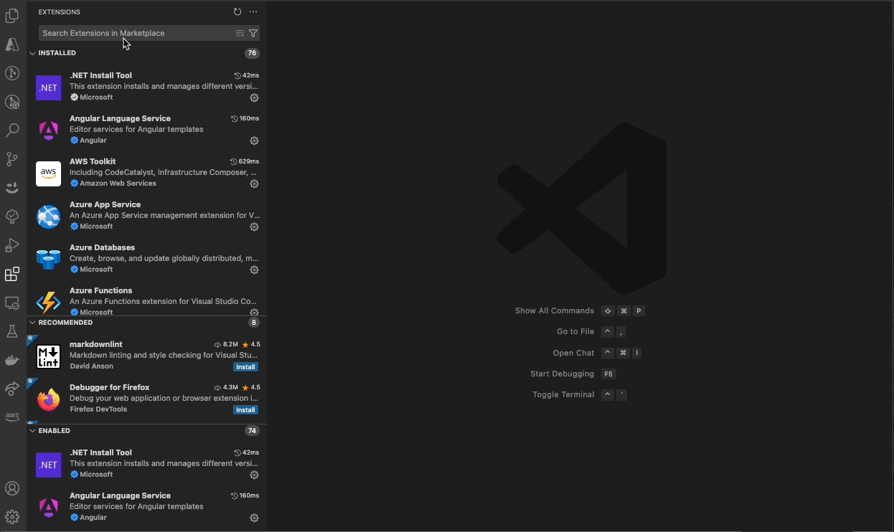

<div align="center">
  
  
  
  
</div>
<br />  
<div align="center">
  <picture>
    <source media="(prefers-color-scheme: dark)" srcset="assets/img/hai_build_logo_light.png">
    <source media="(prefers-color-scheme: light)" srcset="assets/img/hai_build_logo_theme.png">
    
  </picture>
</div>
<br />  

# 🚀 Code Generator

**HAI Code Generator** is a cutting-edge tool designed to simplify and automate task execution while enhancing code generation workflows. Leveraging Specif AI, it streamlines processes like task execution, file identification, and code documentation through intelligent automation and AI-driven capabilities.

> 🏗️ **Built on [Cline](https://github.com/cline/cline)**'s powerful foundation for AI-assisted development.

<div align="center" style="margin-top: 20px;">
  
</div>

## Table of Contents

- [🌟 Overview](#-overview)
- [📥 Getting Started](#-getting-started)
- [✨ Features](#-features)
- [🤝 Contributing](#-contributing)
- [📜 License](#-license)
- [🙏 Acknowledgments](#-acknowledgments)
- [📧 Contact](#-contact)

## 🌟 Overview

**HAI Code Generator** is designed to boost productivity and precision by automating task execution and integrating file management capabilities. It combines intelligent file indexing, context generation, and LLM-driven automation to minimize manual effort and ensure task accuracy. With user-friendly interfaces and configurable settings, HAI Code Generator is perfect for both developers and teams aiming to enhance their workflows.

## 📥 Getting Started
- Open Visual Studio Code → Extensions (⇧⌘X) → Search for “HAI Build” → Click Install
<div align="center" style="margin-top: 20px;">
  
</div>

- Upon installation, the HAI extension can be found in the sidebar.

<div align="center" style="margin-top: 20px;">
  
</div>

## ✨ Features

### 📝 HAI Tasks
Harness the power of AI for seamless task management and user-story execution, HAI Code Generator integrates tasks generated by [Specif AI](https://github.com/presidio-oss/specif-ai), allowing them to be loaded directly into the HAI Tasks page. This streamlined process enables you to:

- **Review** AI-generated tasks within a dedicated interface.  
- **Execute** them instantly with a single click.  
- **Manage** all tasks in one place for improved clarity and productivity.  

By centralizing AI-driven tasks in HAI Code Generator, you can maintain an efficient workflow from ideation to execution.

<br>
  
  <div align="center">
    
    <p><i>Detailed View of HAI Tasks</i></p>
  </div>

- **In-Depth Story Review**  
  - View a story in detail by clicking the Eye icon, along with the corresponding list of tasks, providing comprehensive insights into objectives, prerequisites, and outcomes. 
  
- **In-Depth Task Review**  
  - Similar to user stories, tasks can be viewed in detail and executed directly from the same interface.
  
<br>

---


### 🔍 File Identification
Enhanced file identification with intelligent discovery and retrieval:

  <div align="center">
    
      <p><i>File Identification</i></p>
  </div>

#### Task-Based File Discovery
Transform the way you manage files by leveraging the core functionalities of **Task-Based File Discovery**, supported by advanced components like contextual code comments and indexing.


- **Contextual Code Comments**  
  - Automatically generate contextual comments for every identified file, offering deeper insights and clarifications.  
  - Store all generated comments in a dedicated folder, ensuring they are easily accessible without cluttering your codebase.

- **Faiss DB Indexing**  
  - Built on the robust vector-search engine, Faiss DB ensures real-time and highly accurate file indexing, enabling instant discovery of relevant files.  
  - Handles large repositories effortlessly, ensuring HAI Code Generator scales with your project's needs.

Together, these components form a cohesive system for efficient file identification, ensuring that Task-Based File Discovery is not just smart but also contextual.


---

### Custom Instructions
Uploading custom instruction sets for HAI Code Generator allows you to tailor the tool to your specific needs.
  <div align="center">
    
      <p><i>Custom Instructions</i></p>
  </div>


---

### Inline Editing
Enhance your code editing experience with inline editing, allowing you to make changes directly within the codebase.
  <div align="center">
    
      <p><i>Inline Editing</i></p>
  </div>

#### Seamless Quick Changes
- Simply click on "Edit with hAI" and provide a brief prompt to effortlessly transform the selected portion of your code.
- This feature is particularly useful for making quick edits or corrections without the need to navigate away from the codebase.

---


### ⚙️ Settings Interface
Customize and seamlessly integrate advanced language and embedding models into your AI-powered workflow, ensuring you stay at the forefront of AI innovations.
- **LLM Configuration**   
  - Seamlessly integrate and switch between various language models, ensuring compatibility with the latest AI advancements. Supported models include OpenRouter, Anthropic, Google Gemini, GCP Vertex AI, AWS Bedrock, OpenAI, OpenAI-Compatible models, LM Studio, and Ollama.
  
- **Embedding Configuration**  
  - Effortlessly configure and switch between supported embedding models, ensuring flexibility and adaptability for different use cases. Compatible embedding models include OpenAI-Compatible, OpenAI, and AWS Bedrock.
<div align="center" style="margin-top: 20px;">
  
  <p><i>Settings Interface</i></p>
</div>

## 🤝 Contributing

To contribute to the project, start by exploring [open issues](https://github.com/presidio-oss/cline-based-code-generator/issues) or checking our [feature request board](https://github.com/presidio-oss/cline-based-code-generator/discussions/categories/feature-requests?discussions_q=is%3Aopen+category%3A%22Feature+Requests%22+sort%3Atop).

To get started with HAI Code Generator, follow these steps:

<details>
<summary>Local Development Instructions</summary>

1. Clone the repository _(Requires [git-lfs](https://git-lfs.com/))_:
    ```bash
    git clone https://github.com/presidio-oss/cline-based-code-generator
    ```

2. Open the project in VSCode:
    ```bash
    code cline-based-code-generator
    ```

3. Install the necessary dependencies for the extension and webview-gui:
    ```bash
    npm run install:all
    ```

4. Launch by pressing F5 (or Run -> Start Debugging) to open a new VSCode window with the extension loaded. (You may need to install the [esbuild problem matchers extension](https://marketplace.visualstudio.com/items?itemName=connor4312.esbuild-problem-matchers) if you run into issues building the project.)

</details>
<br/>

Please read our [Contributing Guidelines](./CONTRIBUTING.md) for more details.

## 📜 License

This project is licensed under the Apache 2.0 License. See the [LICENSE](LICENSE) file for more details.

## 🙏 Acknowledgments

Thanks to all contributors and users for their support and feedback.

## 📧 Contact

For any questions or feedback, please contact us at [hai-feedback@presidio.com](mailto:hai-feedback@presidio.com).
