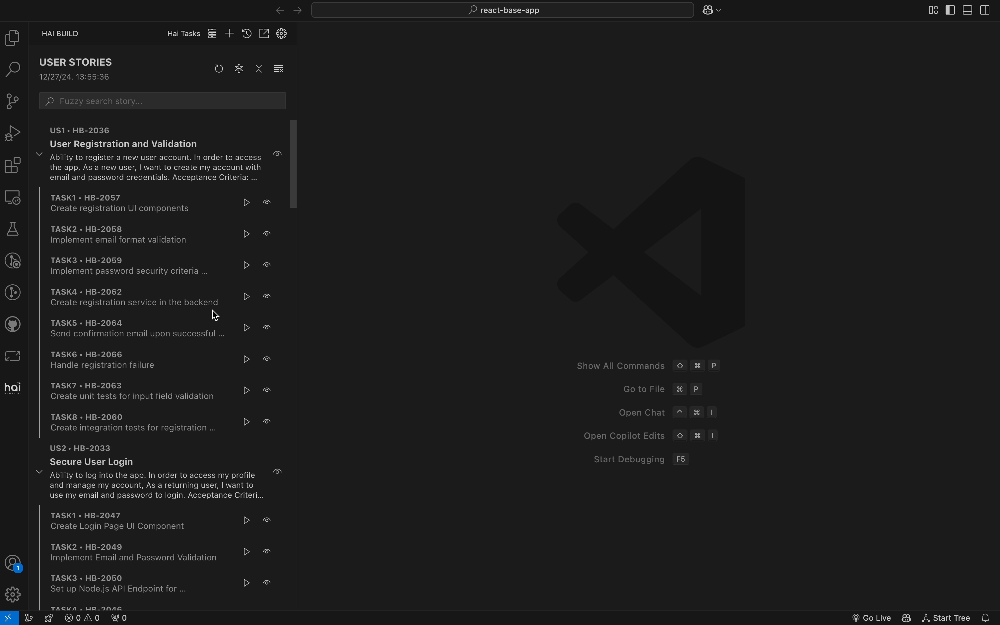

### 📝 HAI Tasks

Harness the power of AI for seamless **task management** and **user-story execution**. The **HAI Code Generator** integrates tasks generated by [Specif AI](https://github.com/presidio-oss/specif-ai), automatically loading them into your **HAI Tasks** page.

This streamlined workflow empowers you to:

-   ✅ **Review** AI-generated tasks in a dedicated interface
-   ⚡ **Execute** them instantly with a single click
-   🗂️ **Manage** all tasks in one place for improved focus and productivity

By centralizing AI-driven tasks, HAI ensures a smooth journey from **ideation to execution** — all within your coding environment.

 

	
	

		<i>Detailed View of HAI Tasks</i>
	

---

#### 🔍 In-Depth Story Review

Dive deeper into your project goals:

-   Click the 👁️ **Eye icon** to view a user story in detail.
-   See associated tasks, objectives, prerequisites, and expected outcomes — all in one view.

#### 🛠️ In-Depth Task Review

Tasks aren’t just items on a checklist:

-   View individual task details.
-   Execute tasks directly from the same interface for maximum efficiency.

🎯 Stay organized, focused, and fast — with **HAI Tasks** guiding your next move.
