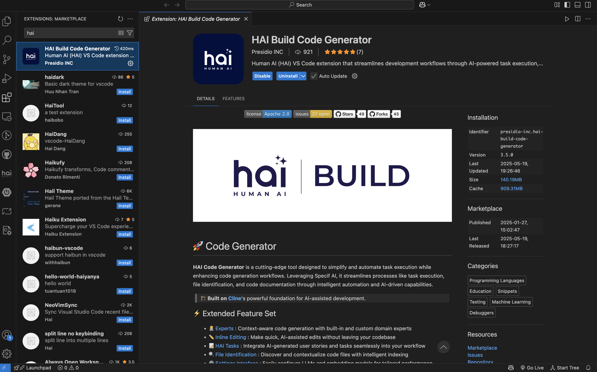

### Installation Options

-   **VS Code Marketplace (Recommended):** Fastest method for standard VS Code.

### 🛠️ VS Code Marketplace: Step-by-Step Setup

Follow these steps to get HAI up and running:

1.  **Open VS Code:** Launch the VS Code application.

    > ⚠️ **Note:** If VS Code shows "Running extensions might...", click "Allow".

2.  **Open Your HAI Folder:** In VS Code, open the HAI folder you created in Documents.
3.  **Navigate to Extensions:** Click on the Extensions icon in the Activity Bar on the side of VS Code (`Ctrl + Shift + X` or `Cmd + Shift + X`).
4.  **Search for 'HAI':** In the Extensions search bar, type `HAI`.

<Frame caption="VS Code marketplace with HAI extension ready to install">
	
</Frame>

1. **Install the Extension:** Click the "Install" button next to the HAI extension.
2. **Open HAI:**
    - Click the HAI icon in the Activity Bar.
    - Or, use the command palette (`Ctrl/Cmd + Shift + P`) and type "HAI: Open In New Tab" for a better view.
3. **Troubleshooting:** If you don't see the HAI icon, try restarting VS Code.

> ✅ **Pro Tip:** You should see the HAI chat window appear in your VS Code editor!

### 💻 Your First Interaction with HAI

You're ready to start building! Copy and paste this prompt into the HAI chat window:

```
Hey HAI! Could you help me create a new project folder called "hello-world" in my HAI directory and make a simple webpage that says "Hello World" in big blue text?
```

> ✅ **Pro Tip:** HAI will help you create the project folder and set up your first webpage!

### 🧩 Tips for Working with HAI

-   **Ask Questions:** If you're unsure about something, ask HAI!
-   **Use Screenshots:** HAI can understand images — show him what you're working on.
-   **Copy and Paste Errors:** Share error messages in the chat for solutions.
-   **Speak Plainly:** Use your own words — HAI will translate them into code.
